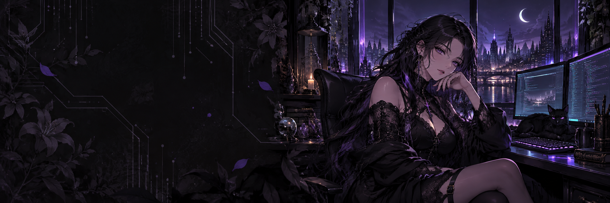

  

<h1 align="center">Olá, eu sou a Nícolly ☾</h1>

  <strong>AI Engineering · Full Stack · Automação</strong> 
  Transformando processos complexos em software que resolve problemas reais.

  <code>Python</code> &nbsp; <code>TypeScript</code> &nbsp; <code>C# / .NET</code> &nbsp; <code>React</code> &nbsp; <code>FastAPI</code>

---

### 🦇 Um pouco sobre mim

Sou desenvolvedora com experiência em automação e aplicações full stack, direcionando meu trabalho para engenharia de IA. Gosto de entender como as coisas funcionam e construir ferramentas que tornem o trabalho mais simples.

- 🧠 Exploro agentes de IA, integração com ferramentas e execução local de modelos.
- ⚙️ Trabalho com automação de processos, APIs e sistemas que precisam funcionar no mundo real.
- ✨ Estou construindo a **Radiant AI**, conectando conhecimento sobre processos à execução de automações.
- 🎮 Fora do código: anime, jogos, estética gótica e ideias para uma futura engine própria.

### ⚡ Minha caixa de ferramentas

| Área | Tecnologias |
| :--- | :--- |
| IA e backend | Python · FastAPI · C# / .NET · Node.js |
| Interfaces | React · TypeScript · Angular · Vue |
| Automação | UiPath · Power Automate · Playwright · Selenium |
| Dados e infraestrutura | PostgreSQL · Docker · Git · Linux |
| Integrações | REST · GraphQL · Microsoft Graph |

### 🌙 Construindo: Radiant AI

Uma plataforma para transformar necessidades de negócio em conhecimento estruturado e automações executáveis.

**O que me interessa nesse desafio:**

- Conectar descoberta de processos, planejamento e execução.
- Criar agentes e workers com estados claros e resultados verificáveis.
- Tratar observabilidade, segurança e governança como parte do produto.

### 🔮 No meu radar

`Agentes de IA` · `RAG` · `Modelos locais` · `Arquitetura de software` · `Game development`

  
<strong>Um pouco do meu lado criativo</strong>

 

Gosto do encontro entre tecnologia e identidade visual: interfaces escuras, tons de violeta, personagens de anime e universos com personalidade. Tenho vontade de construir meus próprios jogos e, com o tempo, uma engine que dê forma a essas ideias.

<!-- OPCIONAL: remova este comentário e substitua os endereços para incluir seus contatos.
### Vamos conversar
[LinkedIn](https://www.linkedin.com/in/SEU_USUARIO/) · [E-mail](mailto:SEU_EMAIL)
-->

---

Entre código, criatividade e um pouco de magia. ☾

